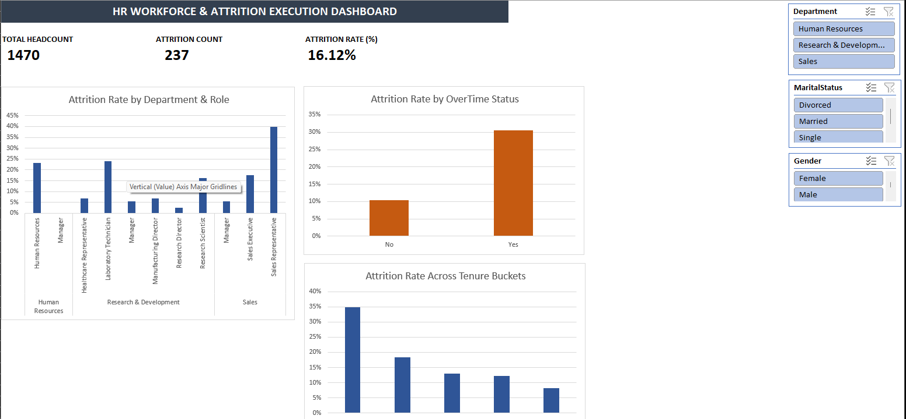

# HR Analytics & Workforce Attrition Executive Dashboard

An interactive, data-driven HR Analytics dashboard built in Microsoft Excel using Power Query, Power Pivot (DAX), and custom Pivot Chart Staging Areas. 

This project explores workforce attrition patterns across key employee dimensions (Department, Job Role, Overtime Status, and Tenure) to deliver actionable retention strategies for leadership.

---

## Executive Dashboard Preview



---

## Business Problem & Objectives

High employee attrition increases recruitment costs and impacts organizational performance. The primary objective of this project is to analyze workforce turnover drivers and provide data-backed recommendations to reduce turnover.

**Key Metrics Tracked:**
* **Total Headcount:** Total active and past workforce size.
* **Attrition Count:** Total number of employees who have left the organization.
* **Attrition Rate (%):** Percentage of total workforce lost to turnover.

---

## Tech Stack & Methodology

| Tool / Technology | Purpose |
| :--- | :--- |
| **Power Query** | Data ingestion, data cleaning, date parsing, and column transformations (`Attrition Flag`). |
| **Power Pivot & DAX** | Built relational Data Model and performance metrics using dynamic DAX measures. |
| **Excel Staging Tables** | Designed structured Pivot Table backends for clean chart mapping. |
| **Interactive Dashboard** | Formatted KPI scorecard, custom visual palettes, and dynamic global slicers. |

---

## Data Modeling (DAX Measures)

The following explicit DAX measures were created in Power Pivot to drive the analysis:

```dax
-- Total Workforce Headcount
Total Headcount := COUNTROWS(tbl_HR_Analytics)

-- Total Attrition Count
Attrition Count := CALCULATE([Total Headcount], tbl_HR_Analytics[Attrition Flag] = 1)

-- Attrition Rate (%)
Attrition Rate (%) := DIVIDE([Attrition Count], [Total Headcount], 0)
